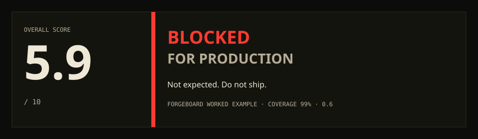

# Vibe-Proof Auditor

**People roast vibe-coded apps in public. I collected those critiques and turned them into an auditor, so any vibe coder can catch the same issues — secrets, weak auth, demo-only tests — without having to know the checklist by heart.**

```bash
npx skills add pedroknigge/vibe-proof-auditor -g -y
```



[](https://skills.sh/pedroknigge/vibe-proof-auditor)


Pre-1.0 (`0.9.4`). A good adversarial agent skill with a deterministic validator. Not a production certification.

```
 __     _____ ____  _____
 \ \   / /_ _| __ )| ____|
  \ \ / / | ||  _ \|  _|
   \ V /  | || |_) | |___
    \_/  |___|____/|_____|
            p r o o f
         ── auditor ──
     catch the dunks yourself
```

The dunks are the same every week. Auth that only lives in `localStorage`. Tests that cover the demo. Secrets in git. IDOR because the UI "hides" the button. A 900-line `utils.ts` that "the model wrote." Those threads already named the failure modes. This skill is that list, pointed at your tree.

You do not memorize it. The agent walks the checklist, scores with evidence, and writes the report. A senior still gets paths, marks, gates, and a copy-paste fix prompt. A vibe coder gets **Why this dunks**: what shipped, what would get screenshot-quoted, and the smallest thing to tell the model. Same audit. No dumbed-down scores.

Shipping is the easy part. Six months later — when someone who did not write it has to change it — is the rest of the test. That is in the checklist too.

Install once. It lands in every coding agent the [Skills CLI](https://github.com/vercel-labs/skills) finds (Grok, Claude Code, Cursor, Codex, Windsurf, Copilot, Gemini CLI, and 70+ more).

## Install (all your agents, all projects)

```bash
npx skills add pedroknigge/vibe-proof-auditor -g -y
```

Antigravity (`agy`) often needs explicit agents — `npx skills` can miss `antigravity-cli`:

```bash
npx skills add pedroknigge/vibe-proof-auditor -g -y -a antigravity -a antigravity-cli
# or close the gap without the skills CLI:
./install.sh
```

`-g` = global (home directory, every project). Omit it to install only in the current repo. `-y` skips prompts. The CLI auto-detects installed agents and **symlinks** them to one copy, so updates are a single pull. `./install.sh` lands the auditor in `~/.agents/skills` plus the Gemini/Antigravity trees (`config/skills`, `antigravity-cli/skills`, `antigravity/skills`) so you do not hand-symlink for `agy`.

The same installer materializes the testless `demo-skill` fixture as a direct AGY child in both native roots:

```text
~/.gemini/config/skills/demo-skill
~/.gemini/antigravity-cli/skills/demo-skill
```

Invoke it as `/demo-skill`. AGY has no `~/.agy/skills` directory. Run `./install.sh --uninstall` to remove both the auditor and direct fixture copies.

This repo is a valid Agent Skill (`SKILL.md` at the root) per [agentskills.io](https://agentskills.io/specification).

## Update

```bash
npx skills update vibe-proof-auditor -g -y
```

Or update every installed skill:

```bash
npx skills update -g -y
```

After a Skills CLI update, run `./install.sh` again to refresh the direct AGY `demo-skill` copies.

## Use

In any supported agent:

- `/vibe-proof-auditor`
- “vibe-proof this repo”
- “auditar proyecto”
- “listo para prod”
- “production checklist”

Point it at a project path. Deep mode is the default. Say “quick” / “rápido” for a short pass (file count does not switch modes). If the host can spawn parallel agents, Deep fans out independent categories and merges once — same gates, one verdict. Prototype and MVP still run the production gates; the **stage note** says whether `BLOCKED` was expected. The write-up always includes a senior evidence block **and** a plain-language **Why this dunks** section so a vibe coder can act on the finding without knowing the checklist by heart — and without losing the path-level proof.

After an audit, harden without pasting the remediation prompt by hand into Antigravity:

```bash
python3 -m vibe_proof_auditor.harden_agy ./vibe-proof-audit-report.md
# preview only:
python3 -m vibe_proof_auditor.harden_agy ./vibe-proof-audit-report.md --dry-run
```

Or tell the agent: “harden with agy”. That runs the report’s Remediation Prompt via `agy -p --add-dir <project>`.

Every pass writes markdown + JSON at the project root (HTML opens only on an interactive TTY):

- `vibe-proof-audit-report.md` — evidence report
- `vibe-proof-audit-report.json` — computed scores / gates / findings
- `vibe-proof-audit-report.html` — styled twin

`vibe_proof_auditor/validate_report.py` recomputes the math. `--sarif` is optional. `vibe_proof_auditor/compare_eval.py --baseline` diffs new Fail rows. Say `professional` for a sober **Why this matters** section.

Planted fixtures: `evals/`. Worked HTML: `docs/example-report.html`.

## One-off without installing

```bash
npx skills use pedroknigge/vibe-proof-auditor
```

## Manual copy (no Node)

```bash
git clone https://github.com/pedroknigge/vibe-proof-auditor.git ~/.grok/skills/vibe-proof-auditor
```

Symlink or copy that folder into the skills directory of each agent you use (`~/.claude/skills/`, `~/.cursor/skills/`, `~/.codex/skills/`, …). Prefer `npx skills add` so updates stay one command.

## Layout

```
vibe-proof-auditor/
├── SKILL.md                      # Agent prompt
├── README.md
├── CHANGELOG.md
├── LICENSE
├── vibe_proof_auditor/
│   ├── scorelib.py               # Weights, floors, verdict math
│   ├── validate-report.py        # Census / scores / verdict; --json --sarif
│   ├── compare-eval.py           # expected.json vs report JSON; --baseline
│   ├── render-report.py          # Markdown → HTML (no scores)
│   └── harden_agy.py             # Remediation Prompt → agy -p
├── install.sh                    # Agents + Antigravity (agy) skill dirs
├── evals/                        # Planted fixtures + expected manifests
│   └── fixtures/skill-docs/      # demo-skill 0.9.4; native AGY, intentionally testless
├── tests/
│   ├── test_render_report.py
│   ├── test_scorelib.py
│   ├── test_validate_report.py
│   ├── test_export_and_eval.py
│   ├── test_harden_agy.py
│   └── test_packaging.py
├── references/
│   ├── checklist.md              # Scored items (only home)
│   ├── gates.md                  # Verdicts and production gates
│   ├── scoring.md                # Formula, weights, N/A matrix
│   ├── security-deep.md          # Security grep playbook
│   ├── prompt-maestro.md         # Short export for other agents
│   └── example-report.md         # Worked report
├── docs/adr/
│   └── 0001-html-render-does-not-score.md
└── assets/
    ├── checklist-template.md     # Cover sheet (not a second item list)
    └── maintenance-policy-template.md  # Stranger-handoff starter
```

Python **3.9+**. The renderer is stdlib only.

```bash
python3 -m py_compile vibe_proof_auditor/scorelib.py vibe_proof_auditor/validate_report.py vibe_proof_auditor/compare_eval.py vibe_proof_auditor/render_report.py
python3 -m unittest discover -s tests -v
```

`main` is protected: CI jobs `renderer` + `gitleaks`, one review on PRs (repo admins can still push so the first workflow can land). Secret scanning and push protection are on.

## Contract (do not restate numbers here)

| Fact | Home |
|------|------|
| Verdict words, absolute/recommended gates, verdict rule, stage notes | `references/gates.md` |
| Weights, formula, floors, scale, product-type N/A matrix | `references/scoring.md` |
| Scored items and human-interview (unscored) items | `references/checklist.md` (only home; the template is a cover) |
| Security grep playbook | `references/security-deep.md` |
| Report format | `SKILL.md` |
| HTML render | `vibe_proof_auditor/render_report.py` |
| HTML render does not score | `docs/adr/0001-html-render-does-not-score.md` |
| Validator recomputes scores / verdict | `vibe_proof_auditor/validate_report.py` (`docs/adr/0002-validator-checks-math.md`) |
| Evidence coverage, insufficient-evidence mark | `references/scoring.md` |
| One worked report | `references/example-report.md` (`docs/example-report.html`) |
| Planted evals | `evals/` |
| JSON / SARIF / baseline | `vibe_proof_auditor/validate_report.py`, `vibe_proof_auditor/compare_eval.py` |
| Harden via Antigravity (`agy`) | `vibe_proof_auditor/harden_agy.py`, `./install.sh` |
| Native AGY `demo-skill` fixture | `evals/fixtures/skill-docs/SKILL.md`, `./install.sh` |

## Related skills

- Architecture-principle ranking → `arquitectura-software-analyzer`
- Over-engineering deletion pass → `ponytail-audit`

## License

MIT
